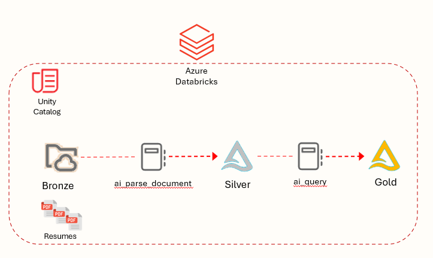

# DatabricksPDF
The purpose of this repo is to showcase how you can take a PDF document such as a resume and using the [ai_parse_document function](https://learn.microsoft.com/en-us/azure/databricks/sql/language-manual/functions/ai_parse_document), you can extract structured content from unstructured documents into a Delta table.   This is showcased in the [Parse Documents to Silver](/src/Parse%20Documents%20to%20Silver.ipynb) notebook.

Using the [ai_query function](https://learn.microsoft.com/en-us/azure/databricks/sql/language-manual/functions/ai_query), you can further curate the data into separate fields via LLMs.  This is showcased in the [PDF Gold](src/PDF%20-%20Gold.ipynb) notebook.

Below is a reference architecture.

For more on this overall topic, check out [PDFs to Production: Announcing state-of-the-art document intelligence on Databricks](https://www.databricks.com/blog/pdfs-production-announcing-state-art-document-intelligence-databricks)

This architecture was for a Proof of Concept and is not considered production level code.  For something more production ready, check out the link at the bottom of the PDFs to Production article referenced above.
